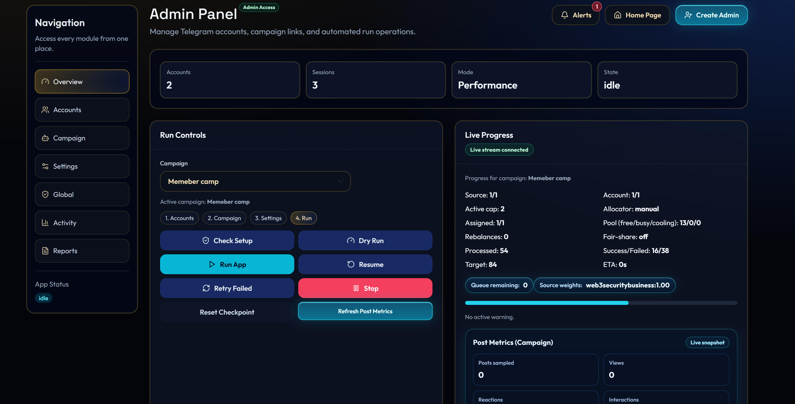
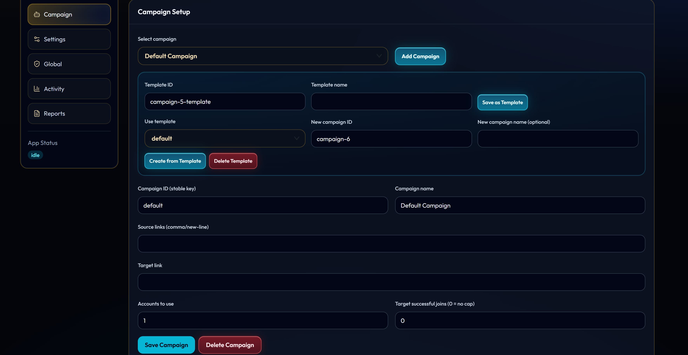
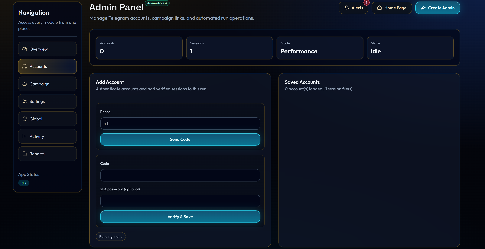
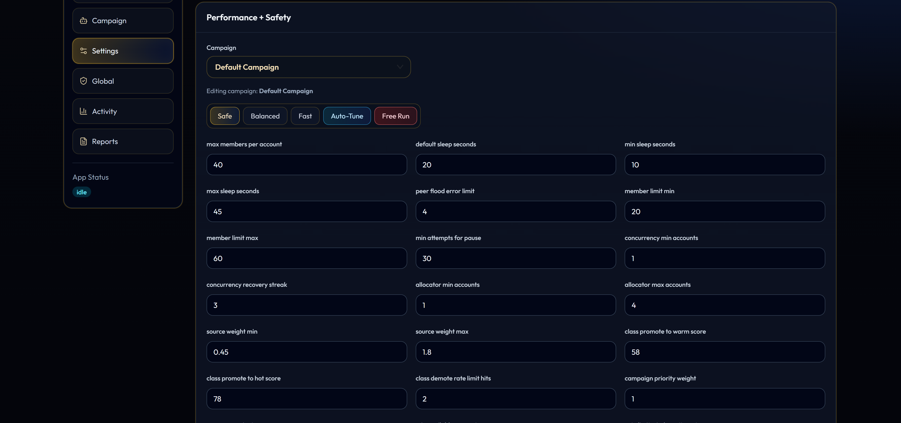
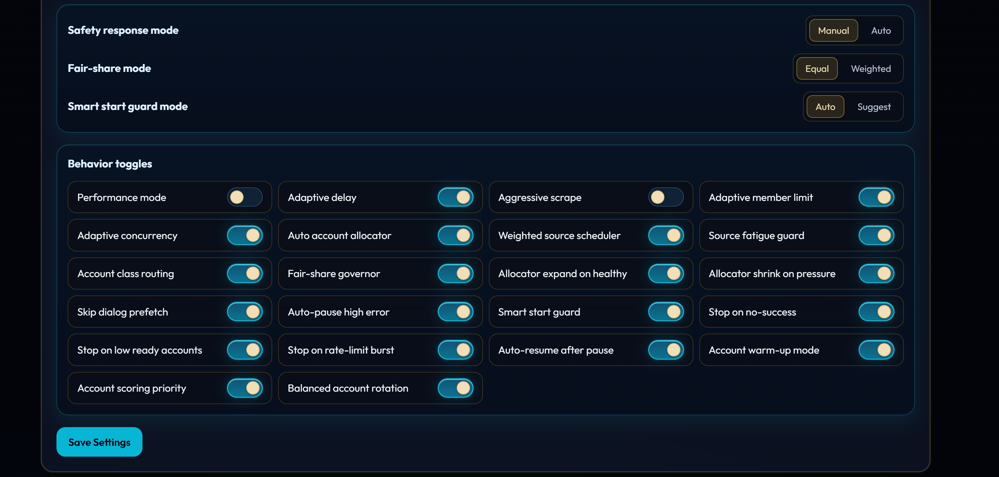
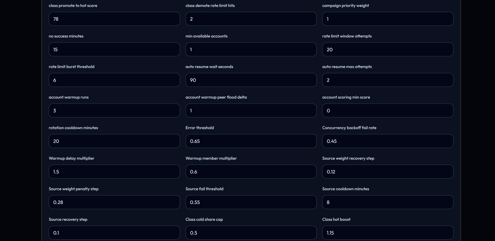
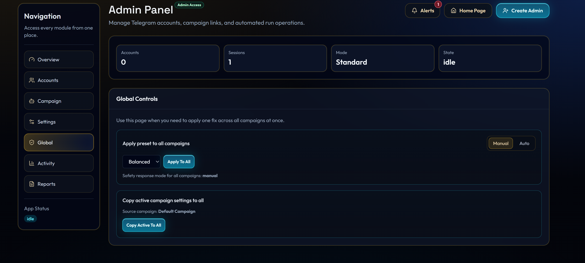

# Smart Telegram Member Manager + Dashboard

<strong>Premium Telegram campaign operations platform</strong>

Run campaigns, manage accounts, apply safety guardrails, and monitor results in one dashboard.

> For access requests, demos, or collaboration, contact me on Telegram: [@scriptsIntern](https://t.me/scriptsIntern)

## Dashboard Screenshots

| Main Dashboard | Campaign View |
|---|---|
|  |  |

| Accounts | Settings Overview |
|---|---|
|  |  |

| Settings Controls | More Settings |
|---|---|
|  |  |

| Global Controls |
|---|
|  |

<strong>Premium Telegram campaign operations platform</strong>

Run campaigns, manage accounts, apply safety guardrails, and monitor results in one dashboard.

> [!IMPORTANT]
> This repository is a public product showcase.  
> Source code is private at this time.

## What This Project Is

Smart Telegram Member Manager is a battle-tested member adder script built for reliable, large-scale campaign execution. It combines multi-account automation, smart safety controls, adaptive performance tuning, and a live dashboard so you can launch, monitor, and optimize campaigns from one place.

## What Users Get

- Dashboard-based campaign control and monitoring
- Multi-account session management with code verification flow
- Multi-campaign architecture with templates and presets
- Smart safety automation to reduce pressure and rate-limit risk
- Real-time progress, logs, checkpoints, and recovery actions
- JSON + CSV reporting for operational review and tuning

## Premium Features

### Campaign Execution
- Bulk member-add campaign flow
- Multi-source support for source links
- Public source scraping with optional aggressive mode
- Auto-join source links during runtime
- Per-account caps and pacing controls
- Cross-source dedupe and progress tracking
- Resume mode from checkpoint
- Retry-failed mode from checkpoint

### Account Operations
- Phone code request and verify workflow
- 2FA-aware verification support
- Session persistence and account deduplication
- Account delete and session cleanup
- Banned account filtering support
- Account health visibility (ready, busy, cooling, warm-up)

### Safety and Stability
- Auto-pause on high error rate
- Stop on no-success window
- Stop on low ready-account threshold
- Stop on rate-limit burst threshold
- Auto-resume with wait and max-attempt controls
- FloodWait/PeerFlood-aware cooldown handling
- Smart Start Guard (`auto` / `suggest`)
- Safety response mode (`manual` / `auto`)

### Smart Performance System
- Auto account allocator with min/max boundaries
- Allocator expand-on-healthy and shrink-on-pressure controls
- Adaptive concurrency backoff and recovery
- Weighted source scheduler
- Source fatigue guard with cooldown windows
- Source quality scoring panel
- Account class routing (`cold`, `warm`, `hot`)
- Promotion/demotion by score and rate-limit history
- Fair-share governor for concurrent campaigns
- Campaign priority weighting in weighted fair-share mode

### Multi-Campaign Management
- Per-campaign settings and runtime files
- Create/update/switch/delete campaign flows
- Save/apply/delete campaign templates
- Presets: `safe`, `balanced`, `fast`
- Auto-tune from latest run report
- Free-run profile mode
- Global action: apply preset to all campaigns
- Global action: copy active settings to all campaigns
- Global action: set safety response mode for all campaigns

### Monitoring and Reporting
- Preflight checks before launch
- Dry-run plan with risk recommendations
- Live progress stream endpoint
- Real-time dashboard payload and activity logs
- Checkpoint reset action
- JSON + CSV run reports
- Error breakdown insights from latest report
- Source quality metrics: score, attempts, success, rate hits, fatigue hits
- Settings backup and restore support

### Utility Tools Included
- Send message from all accounts
- Join group/channel from all accounts
- Leave group/channel from all accounts
- Report group/channel from all accounts
- Hidden-member scrape/add helper flow

## Typical Workflow

1. Add and verify account sessions.
2. Create or select a campaign.
3. Run preflight and review dry-run guidance.
4. Apply preset/template and launch.
5. Monitor live dashboard progress.
6. Resume/retry from checkpoint when needed.
7. Review reports and auto-tune the next run.

## Repository Status

- Public repo: product overview and screenshots
- Source code: private
- Access/release updates: posted in this repository

## Contact

For access requests, demos, or collaboration:  
contact me on Telegram: [@scriptsIntern](https://t.me/scriptsIntern)
